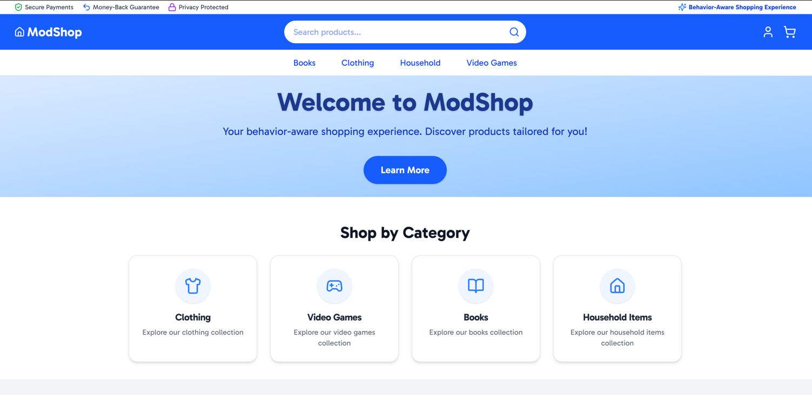
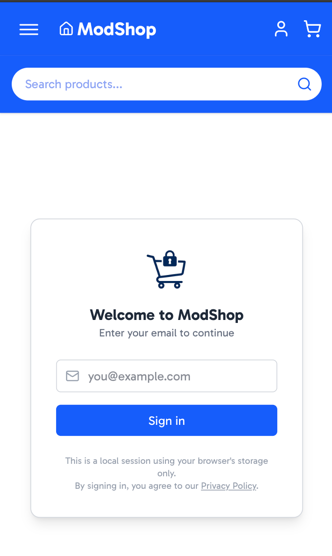
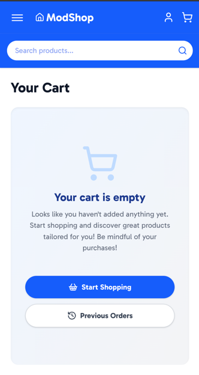
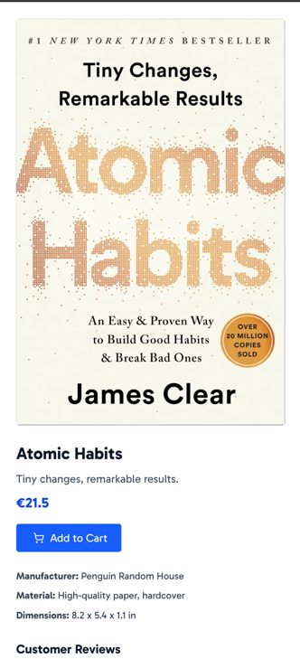

# ModShop

ModShop is a modern, behavior-aware e-commerce web application built with Next.js. It offers a seamless shopping
experience with features like persistent cart, animated interactions, local order history, and a simple profile
system, all running entirely in the browser using local storage. ModShop is designed for demo, prototyping, and
educational purposes. This application is built as part of a group project for the "Designing Human-Centered AI Systems"
master's course at Delft University of Technology.



| Profile                             | Cart                             | Product                             |
|-------------------------------------|----------------------------------|-------------------------------------|
|  |  |  |

## Features

- **Persistent Cart:** Items added to the cart are saved in local storage, allowing users to return later and find their
  cart intact.
- **Animated Interactions:** Smooth animations enhance the user experience, making interactions feel more natural and
  engaging (similar to popular e-commerce sites).
- **Local Order History:** Users can view their past orders, which are stored in local storage for easy access.
- **Simple Profile System:** Users can create a profile and select shopping behavior, which is also stored in local
  storage, and used to personalize the nudges for the user.
- **Nudges:** The application provides personalized nudges based on the user's shopping behavior, enhancing the
  shopping experience. Additionally, over time, the nudges will adapt to the user's behavior according to the
  UCB (Upper Confidence Bound) algorithm, making the nudges more effective and tailored to the user's preferences.
- **MDX Product Descriptions:** Product details are written in MDX format, allowing for rich content with embedded
  components.
- **Responsive Design:** The application is fully responsive, ensuring a great experience on both desktop and mobile
  devices.

## How to Run Locally

1. **Install dependencies:**
   ```bash
   npm install
   # or
   yarn install
   ```

2. **Start the development server:**
   ```bash
   npm run dev
   # or
   yarn dev
   ```

3. **Open your browser:**
   Visit [http://localhost:3000](http://localhost:3000) to use ModShop.

## Tech Stack

- **Framework:** [Next.js](https://nextjs.org) (App Router, React Server/Client Components)
- **Styling:** Tailwind CSS
- **State Management:** React Context API (Cart & Auth)
- **Persistence:** Browser Local Storage (cart, user, orders)
- **MDX:** Product descriptions via MDX files
- **Icons:** [Lucide React](https://lucide.dev)
- **Fonts:** [Gabarito](https://fonts.google.com/specimen/Gabarito) via next/font

---

For more details, see the code and comments in the repository.
